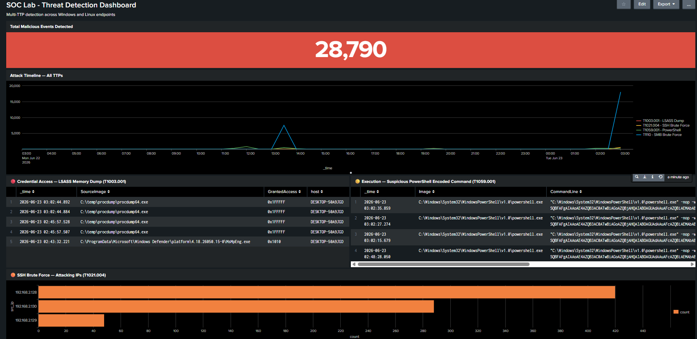
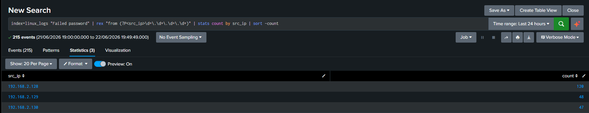
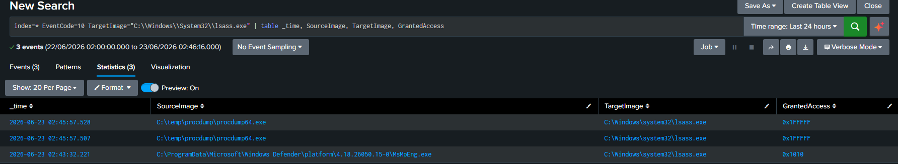
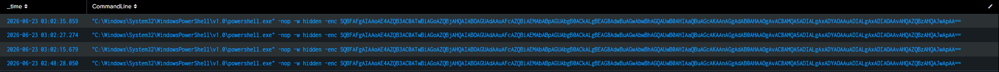
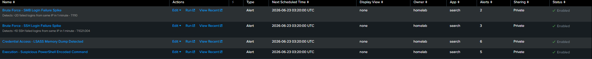

# Detection Engineering Environment — Multi-TTP Threat Detection

> Building a SIEM-backed detection lab from scratch, then attacking it across four MITRE ATT&CK techniques — and proving every alert fires.




---

## Why This Project Exists

Most intrusions don't start with a zero-day. They start with a log line nobody read.

A failed login that became 7,000. A process quietly reaching into `lsass.exe`. A PowerShell command wrapped in Base64 so no one would look twice. Every one of these leaves a trace — the question is whether anyone is watching, and whether the watcher knows what "normal" looks like.

This project is my answer to that question. I built a detection engineering environment from the ground up, generated real adversarial activity against it, and wrote the detection logic that catches each technique. Not a tutorial I followed — an environment I designed, broke, and defended.

---

## Architecture

```
                    ┌─────────────────────────┐
                    │   Kali Linux (Attacker)  │
                    │  192.168.2.128 / .129 /  │
                    │         .130             │
                    └───────────┬─────────────┘
                                │ Attacks
                ┌───────────────┴───────────────┐
                ▼                                ▼
    ┌───────────────────────┐      ┌───────────────────────┐
    │   Windows 10 (Victim) │      │  Ubuntu Server (Victim)│
    │     192.168.2.141     │      │     192.168.2.145      │
    │  Sysmon + Forwarder   │      │   auth.log monitored   │
    └───────────┬───────────┘      └───────────┬───────────┘
                │ Windows Event Logs            │ Linux auth.log
                └───────────────┬───────────────┘
                                ▼
                    ┌───────────────────────┐
                    │   Splunk Enterprise    │
                    │     192.168.2.145      │
                    │  SIEM · Rules · Dash   │
                    └───────────────────────┘
```

| Host | Role | Telemetry Source |
|------|------|------------------|
| Kali Linux | Attacker (3 source IPs) | — |
| Windows 10 | Endpoint victim | Sysmon + Universal Forwarder → Windows Event Logs |
| Ubuntu Server | Endpoint victim + SIEM | Local monitoring → `/var/log/auth.log` |
| Splunk Enterprise | Detection platform | Windows Event Logs + Linux auth.log |

**Design decision — three attacker IPs:** A single attacker hammering a single victim is a lab exercise. Real adversaries distribute activity to evade rate-limiting and dilute detection. I assigned three IP aliases to the Kali node so detections had to hold up against *distributed* source addresses — the way they would in production.

---

## The Four Techniques

Each technique was chosen to cover a different stage of the kill chain, a different telemetry source, and a different detection challenge.

| # | Technique | ATT&CK ID | Tactic | Telemetry | Detection Challenge |
|---|-----------|-----------|--------|-----------|---------------------|
| 1 | SMB Brute Force | T1110 | Credential Access | Windows Event ID 4625 | High-volume threshold tuning |
| 2 | SSH Brute Force | T1021.004 | Lateral Movement | Linux auth.log | Field extraction from raw text |
| 3 | LSASS Memory Dump | T1003.001 | Credential Access | Sysmon Event ID 10 | Distinguishing malicious from system access |
| 4 | PowerShell Encoded | T1059.001 | Execution | Sysmon Event ID 1 | Living-off-the-land detection |

---

## Technique 1 — SMB Brute Force (T1110)

**The attack.** From Kali, a Metasploit `smb_login` scanner threw thousands of credential pairs at the Windows endpoint over SMB (port 445). Windows dutifully logged every failure.

**The trace.** Each failed authentication writes **Event ID 4625**. Over 7,500 of them piled up — a wall of noise that, read correctly, is a confession.

**The detection logic:**
```spl
index=* EventCode=4625
| bucket _time span=1m
| stats count by _time, Source_Network_Address, Account_Name
| where count > 20
| sort -count
```

**The lesson hidden in the field name.** The attacker IP lives in `Source_Network_Address` — *not* `IpAddress`, which renders empty for SMB logon failures. This is the kind of detail that separates a rule that works from a rule that silently never fires. I learned it the way everyone does: by watching an empty column.

> **Detection Rule:** `Brute Force — SMB Login Failure Spike` · Severity: High · >20 failures/min from one IP

---

## Technique 2 — SSH Brute Force (T1021.004)

**The attack.** Hydra ran the `rockyou.txt` wordlist against SSH (port 22) on the Ubuntu server — launched from all three attacker IPs to simulate a distributed campaign.

**The trace.** Linux doesn't hand you structured fields. It hands you a sentence:
```
Failed password for root from 192.168.2.128 port 39266 ssh2
```

**The detection logic:**
```spl
index=linux_logs "Failed password"
| rex "from (?P<src_ip>\d+\.\d+\.\d+\.\d+)"
| bucket _time span=1m
| stats count by _time, src_ip
| where count > 10
| sort -count
```

**Why `rex` matters.** Windows gives you parsed fields. Linux gives you raw text. The `rex` command extracts the attacker IP out of that sentence using a regex capture group — the single most important skill for hunting in Linux logs, where nothing is pre-parsed for you.

The result told the story cleanly: three source IPs, three different volumes — exactly the distributed pattern a tuned detection must survive.

| Source IP | Failed Attempts |
|-----------|-----------------|
| 192.168.2.128 | 120 |
| 192.168.2.129 | 48 |
| 192.168.2.130 | 47 |



> **Detection Rule:** `Brute Force — SSH Login Failure Spike` · Severity: High · >10 failures/min from one IP

---

## Technique 3 — LSASS Memory Dump (T1003.001)

This is the one that matters most — and the one the default config almost missed.

**Why LSASS.** `lsass.exe` holds the kingdom's keys: NTLM hashes, Kerberos tickets, sometimes cleartext credentials. Dump its memory and you can move laterally as anyone. It's the single most valuable target on a compromised Windows host.

**The gap.** The SwiftOnSecurity Sysmon config — excellent as it is — left `ProcessAccess` (Event ID 10) without an LSASS-specific rule. So I wrote one:
```xml
<ProcessAccess onmatch="include">
  <Rule name="LSASS Memory Access Full" groupRelation="and">
    <TargetImage condition="is">C:\Windows\System32\lsass.exe</TargetImage>
    <GrantedAccess condition="is">0x1fffff</GrantedAccess>
  </Rule>
</ProcessAccess>
```

**The attack.** `procdump64 -ma lsass.exe` — 55 MB of process memory written to disk in 0.6 seconds. Windows Defender flagged it instantly, which is itself the proof: this behavior is unambiguously hostile. (Defender was disabled deliberately to let the event reach Sysmon and validate the rule.)

**The detection logic:**
```spl
index=* EventCode=10 TargetImage="C:\\Windows\\System32\\lsass.exe"
| where GrantedAccess="0x1FFFFF"
| table _time, SourceImage, GrantedAccess, host
```



**The detail that makes the rule trustworthy.** Defender itself accesses LSASS constantly — but with `GrantedAccess` of `0x1010` (limited query + read). `procdump` requested `0x1FFFFF` — `PROCESS_ALL_ACCESS`. That access mask is the difference between a routine security scan and a credential theft. A detection that can't tell them apart drowns in false positives. This one can.

> **Detection Rule:** `Credential Access — LSASS Memory Dump Detected` · Severity: Critical

---

## Technique 4 — PowerShell Encoded Command (T1059.001)

**The attack.** A single line of "living off the land" — PowerShell, already trusted, already everywhere:
```powershell
powershell -nop -w hidden -enc SQBFAFgAIAAoAE4AZQB3...
```

Three red flags in one command: `-nop` (skip security profiles), `-w hidden` (invisible window), `-enc` (Base64-encoded payload). Decoded, it reached out to the attacker to pull a second-stage payload.

**The detection logic:**
```spl
index=* EventCode=1 Image="*powershell*"
| where like(CommandLine, "%-enc%") OR like(CommandLine, "%-w hidden%")
| table _time, CommandLine, ParentImage, host
```



**The judgment call.** An encoded command isn't proof of compromise — admins use them legitimately. So the rule treats it as a *trigger for investigation*, not a verdict. The analyst's job starts where the alert ends: decode the Base64, read the intent, decide. Detection engineering isn't about certainty — it's about putting the right signal in front of the right human at the right moment.

> **Detection Rule:** `Execution — Suspicious PowerShell Encoded Command` · Severity: High

---

## The Dashboard

All four techniques converge into a single SOC dashboard aggregating **28,000+ malicious events** across both endpoint types:

- **Total Events** — single-value health indicator (red block on threshold breach)
- **Attack Timeline** — all four TTPs plotted over time, color-coded by technique
- **LSASS Access Table** — every `ProcessAccess` against `lsass.exe`, with access masks
- **PowerShell Table** — full encoded command lines, untruncated
- **Attacker IP Breakdown** — distributed SSH sources, ranked

The timeline tells the whole story at a glance: a flat baseline, then the unmistakable spikes of an environment under attack.

All four detection rules, firing on schedule:



---

## What This Demonstrates

This wasn't about running tools. It was about closing the loop:

**Attack → Telemetry → Detection → Validation.**

For every technique I generated the activity, located the trace, wrote the rule, and confirmed the alert fired. I tuned thresholds against distributed sources, extracted fields from raw Linux logs, distinguished malicious memory access from routine system access by reading access masks, and made the deliberate call to treat ambiguous signals as investigation triggers rather than false verdicts.

The result is a working, multi-source, multi-technique detection environment — and a clear demonstration of how a defender thinks when the logs start talking.

---

## Tech Stack

`Splunk Enterprise` · `Sysmon` · `Windows Event Logs` · `Linux auth.log` · `Hydra` · `Metasploit` · `ProcDump` · `MITRE ATT&CK` · `VMware Workstation`

---

*Built and documented by Omar Tayiawi — SOC Analyst · Incident Response · Threat Hunting · Detection Engineering*
